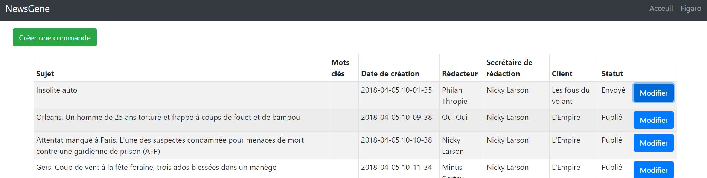

# MongoDB - ReactJS - Sockets - PHP - Python

Il faut lancer l'executable `mongod` pour démarrer le serveur de base de données MongoDB.

`yarn` - pour installer les dépendances

`yarn start:server` - pour lancer le serveur NodeJS

`yarn start` - pour lancer l'application ReactJS

 